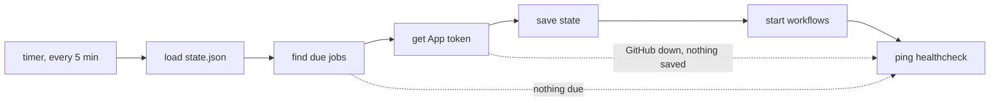

<p align="center">
  <a href="https://github.com/katoptra">
    <picture>
      <source media="(prefers-color-scheme: dark)" srcset="https://katoptra.org/brand/katoptra-mark-dark-224.png">
      
    </picture>
  </a>
</p>

<h1 align="center">dispatch</h1>

<p align="center">The scheduler that starts the katoptra mirrors.</p>

<p align="center">
  <a href="https://github.com/katoptra/dispatch/actions/workflows/check.yml"></a>
  <a href="LICENSE"></a>
  <a href="https://github.com/katoptra/dispatch#how-it-works"></a>
</p>

Each katoptra mirror is a GitHub Actions workflow that has no schedule. The scheduler in
this repository starts these workflows.

- A systemd timer on a NixOS host starts a tick at intervals of five minutes.
- Each tick finds the jobs to start and starts their workflows. Then the tick sends a ping
  to a healthcheck.
- If the host stops, each job that had no run for its slots gets one run when the host
  starts again.
- A job does not get two runs for the same slot.
- The scheduler is one Go binary, and it uses only the Go standard library.

## Adding a job

Each repository has one file in [`schedules/`](schedules). The file has the name of the
repository:

```go
// schedules/ctan.go
var _ = register(Job{Repo: "katoptra/ctan", File: "sync.yml", Slots: Hourly})
```

Each slot is at minute 42 of the hour, UTC:

| Slot | UTC | Pacific (winter) |
|---|---|---|
| `Hourly` | each hour at :42 | each hour at :42 |
| `Evening` | 05:42 | 21:42 |
| `Overnight` | 11:42 | 03:42 |
| `Morning` | 17:42 | 09:42 |
| `Afternoon` | 23:42 | 15:42 |

- `S0` to `S23` are the names of the hours. The four daily names are the same slots as
  `S5`, `S11`, `S17` and `S23`.
- To put slots together, use `|`, for example `Morning | Evening`.
- An incorrect slot name causes a compile error.

This repository cannot examine the workflow. Make sure that the workflow has these three
items:

- It has `workflow_dispatch:` in `on:`.
- It has a `concurrency` group with `cancel-in-progress: false`. Thus, a second start waits
  for the end of the first run.
- It sends a ping to its healthcheck. The scheduler starts runs, but it does not know the
  result of a run.

The host gets a change when the host's flake moves its lock to a new commit of this flake.
A new job starts at the next tick.

## How it works



The timer starts a tick at :02, at :07, and at intervals of five minutes after that. Each
tick does these steps:

1. It loads `state.json`, which contains the last dispatched slot of each job.
2. It finds the jobs to start. If a job had no run for some slots, it starts one time, for
   the latest slot.
3. It gets a token for the GitHub App.
4. It saves the new state.
5. It starts the workflow of each of these jobs on `main`.
6. It sends a ping to the healthcheck: to the URL if the tick has no errors, or to `/fail`
   with the errors.

The tick saves the state before it starts a workflow. If a crash stops the tick after that
step, the job gets no run for that slot. The job starts again at its next slot. Thus, a run
does not start two times. If GitHub is not available when the tick sends the token request,
the tick does not save the state. Then the next tick tries again.

Before each retry, the scheduler waits 10, 20, and then 40 seconds. The retry rules are:

- A token request tries again after a 5xx, 408, 429, or network error.
- A workflow start tries again only after a 408, a 429, or a connection that did not open.
  GitHub can send a 5xx after it started the run. Then a retry can start a second run.
- GitHub gets two minutes in each tick. Thus, the tick has time to send its ping to the
  healthcheck.

[`CLAUDE.md`](CLAUDE.md) gives the design and the cause of each rule.

## Operating it

`task` without a task name prints the menu. Use these commands on a laptop:

```sh
task check          # gofmt, go vet and go test in the toolbox image, the same as CI
task targets        # each job and its slot times, in UTC
task runs           # the last 3 runs of each job on GitHub (gh must have a login)
task runs LIMIT=10  # more runs for each job
```

On GitHub, a run that the scheduler starts has the event `workflow_dispatch`. Use these
commands on the host:

```sh
systemctl list-timers katoptra-dispatch.timer
journalctl -u katoptra-dispatch -n 50
journalctl -u katoptra-dispatch -p err
sudo cat /var/lib/private/katoptra-dispatch/state.json
sudo STATE_DIRECTORY=/var/lib/private/katoptra-dispatch katoptra-dispatch --dry-run
```

`--dry-run` shows the jobs to start, with the slot of each and its last dispatched slot. It
does not save the state, start a workflow, or send a ping.

### When something goes wrong

- **The healthcheck gets no pings.** The host or its timer does not operate. When the host
  and the timer operate again, each job that had no run for a slot gets one run.
- **The healthcheck gets a `/fail` ping.** The body of the ping and
  `journalctl -u katoptra-dispatch -p err` show the error. If the error is from a workflow
  start, that job gets no run for that slot, and it starts again at its next slot. If the
  error occurs before the tick saves the state, the tick records no slot, and the next tick
  tries again.
- **A workflow start gets a 404.** The default branch of the repository is not `main`, or
  the repository does not have the workflow file.
- **Each tick stops with an error about `state.json`.** The file is corrupted. No job starts
  until you repair the file. Repair or delete the file manually. If you delete it, each job
  starts one time.

## Want your own?

1. **Fork this repository.** Replace the files in `schedules/` with files for your jobs.
   The tests accept only `katoptra/` repositories. Change that prefix in the tests to the
   name of your organization. In `main.go`, change `Org: "katoptra"` to the name of your
   organization.
2. **Make a GitHub App in your organization:**
   1. Give the App one permission: Actions, read and write. A webhook is not necessary.
   2. Install the App on all repositories in the organization. Then each new repository
      also gets the App automatically.
   3. Record the App ID.
   4. Make a private key. You can use the key in the format that GitHub gives.
3. **Make a healthchecks.io check** with a period of 5 minutes and a grace time of 10
   minutes.
4. **Add the flake to your NixOS host.** Give the module the paths of three files:

   ```nix
   {
     imports = [ inputs.katoptra-dispatch.nixosModules.default ];
     services.katoptra-dispatch = {
       enable = true;
       appIdFile = "/run/secrets/dispatch-app-id";
       privateKeyFile = "/run/secrets/dispatch-private-key";
       healthcheckUrlFile = "/run/secrets/dispatch-healthcheck-url";
     };
   }
   ```

   **Caution:** Write each path as a string, not as a Nix path. A Nix path puts a copy of the
   secret in the Nix store. All users on the host can read the Nix store.

   systemd loads the files with `LoadCredential=`. Thus, the files can have the owner `root`
   and the mode 0400.
5. **Make sure that the scheduler operates:**
   1. On a laptop with go-task and Docker or Apple `container`, use `task check`. Then use
      `task targets`.
   2. Use `nix flake check`. It builds the package and the systemd units.
      [`CLAUDE.md`](CLAUDE.md) shows how to use it without nix.
   3. Only a tick on the host is a full test of the App. On the host, use
      `sudo systemctl start katoptra-dispatch`. Then read the journal.

## License

The license is MIT. [Josh Vaughen](https://ijosh.com) made this repository. You can send a
pull request.
